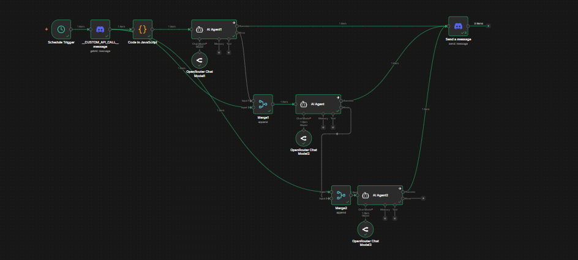
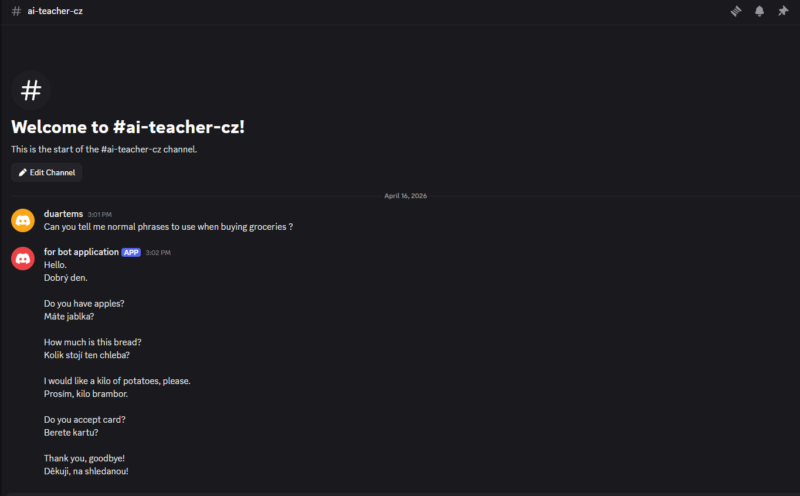

🤖 AI Language Tutor Automation (n8n + Discord)

This project is an automated workflow built with n8n that connects Discord with custom AI agents to help users learn Czech from English in a practical, real-world context.

🚀 Overview

The system listens to messages sent in Discord, processes them through an AI agent customized as an English → Czech teacher, and returns useful language guidance.

Instead of simple translation, the AI:

Understands the situation described by the user
Suggests common phrases you would naturally say in that context
Provides the Czech translation for each phrase
🧠 How It Works

A user sends a message in Discord describing a situation

Example: "ordering food at a restaurant"

The message is captured by n8n
The workflow sends the input to a custom AI agent that:
Interprets the situation
Generates relevant English phrases
Translates them into Czech
The formatted response is sent back to Discord
🔁 Built-in Redundancy (Failover System)

To ensure reliability, this project includes a multi-agent fallback mechanism:

✅ Primary AI agent handles the request
⚠️ If it fails → a secondary agent (different API key) takes over
⚠️ If that also fails → a third agent is used
🎯 The first successful response is returned to Discord

This guarantees high availability and minimizes downtime due to API issues.

🧩 Tech Stack
n8n – Workflow automation
Discord API – User interaction layer
AI Agents (LLMs) – Language processing and teaching
Multiple API Keys – Redundancy & failover handling
📦 Features
💬 Discord-based interaction
🌍 Context-based language learning
🗣️ Real-life phrase suggestions
🇨🇿 English → Czech translation
🔁 Automatic failover between AI agents
⚡ Fully automated workflow
🛠️ Example Output

User Input:

asking for directions

Bot Response:

Common phrases:

1. "Excuse me, where is the train station?"
   → "Promiňte, kde je vlakové nádraží?"

2. "How do I get to the city center?"
   → "Jak se dostanu do centra města?"

3. "Is it far from here?"
   → "Je to odsud daleko?"

   
   
